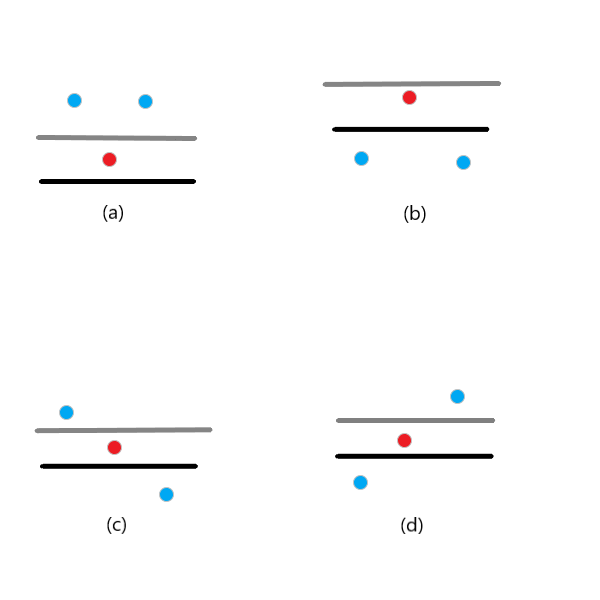

# 202109-2 非零段划分

## 70% 数据——模拟

题目中说明 $A_i\in[0, 10000]$。当 $p>10000$ 后，$A$ 数组则成为全 $0$ 数组，
所以我们只需考虑 $k\in[1, 10000]$ 时的非零段个数，不妨设 $m=10000$。

我们可以针对每一个 $p$，计算出 $A$ 数组的情况，进而计算非零段的个数，不断更新答案。
在维护 $A$ 数组的时候，我们可以让 $p$ 递增更新。
这样在 $p$ 更新的时候，只需要将 $A_i=p-1$ 处更新为 $0$ 即可。

时间复杂度 $\mathrm{O}(nm)$。

## 100% 数据——避免不必要更新

在上个做法中，时间主要浪费在了对 $A$ 数组的更新与重复计算非零段上。
对于每一个非零 $A_i$，随着 $p$ 逐渐增大，其最多改变一次，即变为 $0$。
而在上面的方法中，我们忽略了这个条件，每次都对所有的元素进行检查，无论其是否为 $0$。

考虑每个 $A_i$ 变为 $0$ 时对非零段个数的贡献。
为了简化后续讨论，这里给出一个推论：

!!! note "相邻相等元素与单个元素等价"
    对于一段值相同的区间，可以把它们看做成其中任意的一个元素。

    这一点很好理解：既然值相同，那么这一段在变为 $0$ 时必然是同时改变。

通过以上推论，我们先缩小 $A$ 数组的元素个数，直到任意相邻两个元素都不同，之后考虑每个元素对整体的贡献。
只看元素本身看不出什么，一种思路是查看与之相邻的两个元素。

<figure markdown>
  { width="300" }
  <figcaption>图 1：相邻元素的四种情况</figcaption>
</figure>

如图，红色点代表将要变为 $0$ 的元素，蓝色点为相邻两个元素；黑线以下为目前变为 $0$ 的元素。我们对以上四种情况进行分类讨论：

1. 当左右相邻元素均大于中间元素时：当中间元素变为 $0$ 时，原本一个非零段分成了两个非零段，对非零段个数贡献 $+1$；
2. 当左右相邻元素均小于中间元素时：当中间元素变为 $0$ 之前，左右元素均已变成 $0$，中间元素是孤立的非零段，在中间元素变为 $0$ 后，非零段个数减少，对非零段个数贡献 $-1$；
3. 其他两种情况：相当于某个非零段的边界去掉了一个元素，对非零段个数无影响。

针对边界元素而言，可以将其缺失的相邻元素视为 $0$。

同时，考虑到我们只需要求解非零段的个数，并不需要输出对应 $A$ 数组的状态，我们可以将每个元素的贡献（当然只有在对应 $p=A_{i}+1$ 时才会有贡献）累加，成为每个 $p$ 对应的贡献。
这样我们就可以先求出初始状态的非零段个数，之后随着 $p$ 增加利用之前求出的贡献进行更新，就可以比较快速地解决。

求出每个元素的贡献、并累加到对应 $p$ 的复杂度为 $\mathrm{O}(n)$，计算每一个 $p$ 的最后贡献的复杂度为 $\mathrm{O}(m)$，整体复杂度 $\mathrm{O}(n+m)$。

<a id="code1"></a>

???+ success "代码实现"

    === "C++"

        ```cpp linenums="1"
        #include <algorithm>
        #include <cmath>
        #include <cstdio>
        #include <cstring>
        #include <iostream>
        using namespace std;
        const int maxn = 500010;
        const int maxm = 10010;
        int n;
        int a[maxn];
        int sum[maxm];
        // sum[i] 表示 p = i 时的贡献
        // 注意当 a[i] 发生变化时，p = a[i] + 1
        int main() {
            scanf("%d", &n);
            for (int i = 1; i <= n; ++i) {
                scanf("%d", &a[i]);
            }
            // 去掉数组中相同元素段
            int tot = 0;
            a[++tot] = a[1];
            for (int i = 2; i <= n; ++i) {
                if (a[i] == a[i - 1])
                    continue;
                a[++tot] = a[i];
            }
            n = tot;
            // 对非两侧元素进行处理
            for (int i = 2; i < n; ++i) {
                if (a[i] < a[i - 1] && a[i] < a[i + 1]) {
                    // 中间小两侧大，贡献 +1
                    ++sum[a[i] + 1];
                }
                if (a[i] > a[i - 1] && a[i] > a[i + 1]) {
                    // 中间大两侧小，贡献 -1
                    --sum[a[i] + 1];
                }
            }
            // 处理两侧元素
            if (n > 1 && a[1] > a[2])
                --sum[a[1] + 1];
            if (n > 1 && a[n] > a[n - 1])
                --sum[a[n] + 1];
            // 计算初始情况 p = 1 时的非零段数 cur
            int cur = 0;
            for (int i = 1; i <= n; ++i) {
                if (a[i] == 0 && a[i - 1] != 0)
                    ++cur;
            }
            if (a[n])
                ++cur;
            // 计算并得到最大的非零段数
            int ans = cur;
            for (int i = 2; i <= 10001; ++i) {
                cur += sum[i];
                if (cur > ans) {
                    ans = cur;
                }
            }
            printf("%d", ans);
            return 0;
        }
        ```