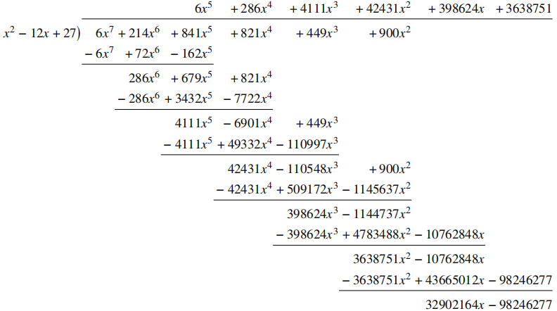

# 202112-3 登机牌号码

## 40% 数据——直接模拟

这一部分数据满足 $s=-1$，即校验码为空。
我们按照题目要求进行对应操作即可，大体分为以下几个步骤：

1. 得到数字序列，注意不同模式的切换以及最后的补全。
2. 将得到的数字转换为码字。
3. 根据有效数据区每行能容纳的码字数 $w$ 及目前码字个数，在末尾补充码字。注意不要忽略长度码字。
4. 输出结果。

<a id="code1"></a>

???+ success "代码实现"

    === "C++"

        ```cpp linenums="1"
        #include <algorithm>
        #include <cmath>
        #include <cstdio>
        #include <cstring>
        #include <iostream>
        #include <vector>
        using namespace std;
        const int maxn = 210;
        const int mod = 929;
        int w, lev;
        char s[100010];
        int n;
        vector<int> numberList; // 数字序列
        vector<int> codeWord;   // 码字序列
        int currentMode; // 目前编码器模式。0:大写模式 1:小写模式 2:数字模式
        void checkmode(char c) {
            /*
                检查将要输出的下个字符与目前模式是否匹配，
                若不匹配，则输出对应更改模式步骤。
            */
            if (c >= '0' && c <= '9') {
                if (currentMode != 2) {
                    numberList.push_back(28);
                    currentMode = 2;
                }
            } else if (c >= 'a' && c <= 'z') {
                if (currentMode != 1) {
                    numberList.push_back(27);
                    currentMode = 1;
                }
            } else if (c >= 'A' && c <= 'Z') {
                if (currentMode == 1) {
                    numberList.push_back(28);
                    numberList.push_back(28);
                    currentMode = 0;
                }
                if (currentMode == 2) {
                    numberList.push_back(28);
                    currentMode = 0;
                }
            }
        }
        int main() {
            scanf("%d%d", &w, &lev); // lev 表示校验级别
            scanf("%s", s);
            n = strlen(s);
            // 步骤一：得到数字序列
            currentMode = 0; // 初始为大写模式
            for (int i = 0; i < n; ++i) {
                checkmode(s[i]);
                if (s[i] >= '0' && s[i] <= '9') {
                    numberList.push_back(s[i] - '0');
                } else if (s[i] >= 'a' && s[i] <= 'z') {
                    numberList.push_back(s[i] - 'a');
                } else if (s[i] >= 'A' && s[i] <= 'Z') {
                    numberList.push_back(s[i] - 'A');
                }
            }
            if (numberList.size() % 2)
                numberList.push_back(29);
            // 步骤二：转换为码字
            for (int i = 0; i < numberList.size(); i += 2) {
                codeWord.push_back(30 * numberList[i] + numberList[i + 1]);
            }
            // 步骤三：补充码字
            while ((1 + codeWord.size()) % w != 0) {
                codeWord.push_back(900);
            }
            // 步骤四：输出结果
            codeWord.insert(codeWord.begin(), codeWord.size() + 1);
            for (int i = 0; i < codeWord.size(); ++i) {
                printf("%d\n", codeWord[i]);
            }
            return 0;
        }
        ```

## 100% 数据——模拟+多项式除法

这部分数据要求我们对校验码进行处理，所以步骤变为：

1. 得到数字序列，注意不同模式的切换以及最后的补全。
2. 将得到的数字转换为码字。
3. 根据有效数据区每行能容纳的码字数 $w$、目前码字个数以及{\heiti{校验码的位数}}，在末尾补充码字。注意不要忽略长度码字。
4. 输出数据码部分结果。
5. 计算得出校验码，并输出。

校验码的位数能比较方便得出，关键在于校验码的计算。考虑关键公式：

\begin{equation*}
  x^kd(x)\equiv q(x)g(x)-r(x)
\end{equation*}

其中 $d(x)$ 是 $n-1$ 次多项式（已知），$g(x)$ 是 $k$ 次多项式（已知），
未知项有 $q(x),r(x)$，其中 $r(x)$ 为所求。

考虑消去 $q(x)$ 的影响：可以在两端同时对 $g(x)$ 取余，则 $q(x)g(x)$ 项会被直接消去，可以化所求式为：

\begin{equation*}
  x^kd(x)\equiv -r(x) \mod q(x)
\end{equation*}

所以目前问题转化为求解 $x^kd(x) \mod q(x)$。

???+ note "多项式带余除法"
    若 $f(x)$ 和 $g(x)$ 是两个多项式，且 $g(x)$ 不等于 $0$，
    则存在唯一的多项式 $q(x)$ 和 $r(x)$，满足：

    \begin{equation*}
      f(x)=q(x)g(x)+r(x)
    \end{equation*}

    其中 $r(x)$ 的次数小于 $g(x)$ 的次数。此时 $q(x)$ 称为 $g(x)$ 除 $f(x)$ 的商式，$r(x)$ 称为余式。

???+ note "多项式长除法"
    求解多项式带余除法的一种方法，步骤如下：
    1. 把被除式、除式按某个字母作降幂排列，并把所缺的项用零补齐；
    2. 用被除式的第一项除以除式第一项，得到商式的第一项；
    3. 用商式的第一项去乘除式，把积写在被除式下面（同类项对齐），消去相等项，把不相等的项结合起来；
    4. 把减得的差当作新的被除式，再按照上面的方法继续演算，直到余式为零或余式的次数低于除式的次数时为止。

下面展示的是一个多项式长除法的例子：



得到求解多项式带余除法的步骤后，考虑求解 $r(x)$ 的步骤：

1. 计算 $g(x)=(x-3)(x-3^2)\cdots(x-3^k)$；
2. 计算 $x^kd(x)$；
3. 计算 $x^kd(x) \mod g(x)$，得到 $-r(x)$；
4. 对得到的每一项取反即可得到 $r(x)$。

计算 $g(x)$：考虑到每一次多项式乘以的因子都是 $(x-a)$ 的格式，
所以可以把 $A(x-a)$ 的多项式相乘转化为 $xA-aA$ 的格式。
$xA$ 可以通过整体移项实现；在移项后，原本在 $x^i$ 的系数成为 $x^{i+1}$ 的系数，
所以可以在一个数组上，从低位到高位依次计算，得到结果。

计算 $x^kd(x)$：这部分比较简单，将低 $k$ 位的系数赋 $0$，再将已计算出的数据位放入对应位置即可。

计算 $x^kd(x) \mod g(x)$：利用上文提到的多项式长除法即可。本题 $g(x)$ 的最高位系数恒为 $1$，简化了计算。

<a id="code2"></a>

???+ success "代码实现"

    === "C++"

        ``` { .cpp .annotate linenums="1" hl_lines="44-88 111-118 120 128-131"}
        #include <algorithm>
        #include <cmath>
        #include <cstdio>
        #include <cstring>
        #include <iostream>
        #include <vector>
        using namespace std;
        const int maxn = 210;
        const int mod = 929;
        int w, lev;
        char s[100010];
        int n;
        vector<int> numberList;
        vector<int> codeWord;
        int verifyCodeLen; // 校验码长度
        int currentMode;
        void checkmode(char c) {
            /*
                检查将要输出的下个字符与目前模式是否匹配，
                若不匹配，则输出对应更改模式步骤。
            */
            if (c >= '0' && c <= '9') {
                if (currentMode != 2) {
                    numberList.push_back(28);
                    currentMode = 2;
                }
            } else if (c >= 'a' && c <= 'z') {
                if (currentMode != 1) {
                    numberList.push_back(27);
                    currentMode = 1;
                }
            } else if (c >= 'A' && c <= 'Z') {
                if (currentMode == 1) {
                    numberList.push_back(28);
                    numberList.push_back(28);
                    currentMode = 0;
                }
                if (currentMode == 2) {
                    numberList.push_back(28);
                    currentMode = 0;
                }
            }
        }
        vector<int> get_gx(int k) { // (1)
            // 根据 k 计算 g(x)
            vector<int> res;
            res.push_back(mod - 3);
            res.push_back(1);
            int a0 = 3;
            for (int i = 2; i <= k; ++i) {
                a0 = (a0 * 3) % mod;
                res.insert(res.begin(), 0); // 在最低位插入 1，即整体次数 +1
                for (int j = 0; j < i; ++j) {
                    res[j] = (res[j] - (a0 * res[j + 1]) % mod + mod) % mod;
                }
            }
            return res;
        }

        void get_verify_code() {
            // 计算校验码并输出
            vector<int> tmp;
            vector<int> g = get_gx(verifyCodeLen);
            // 初始化 x^kd(x)
            for (int i = 1; i <= verifyCodeLen; ++i) {
                tmp.push_back(0);
            }
            for (int i = codeWord.size() - 1; i >= 0; --i) {
                tmp.push_back(codeWord[i]);
            }
            // 多项式长除法计算结果
            for (int i = tmp.size() - 1; i >= verifyCodeLen; --i) {
                int val = tmp[i];
                for (int j = 0; j < g.size(); ++j) {
                    tmp[i - j] =
                        (tmp[i - j] - (val * g[g.size() - 1 - j]) % mod + mod) % mod;
                }
            }
            // 将 -r(x) 转化为 r(x)
            for (int i = 0; i < verifyCodeLen; ++i) {
                // 注意：不能直接 mod - tmp[i]，因为 tmp[i] 可能为 0
                tmp[i] = (mod - tmp[i]) % mod;
            }
            // 输出结果
            for (int i = verifyCodeLen - 1; i >= 0; --i) {
                printf("%d\n", tmp[i]);
            }
        }
        int main() {
            scanf("%d%d", &w, &lev);
            scanf("%s", s);
            n = strlen(s);
            // 步骤一：得到数字序列
            currentMode = 0;
            for (int i = 0; i < n; ++i) {
                checkmode(s[i]);
                if (s[i] >= '0' && s[i] <= '9') {
                    numberList.push_back(s[i] - '0');
                } else if (s[i] >= 'a' && s[i] <= 'z') {
                    numberList.push_back(s[i] - 'a');
                } else if (s[i] >= 'A' && s[i] <= 'Z') {
                    numberList.push_back(s[i] - 'A');
                }
            }
            if (numberList.size() % 2)
                numberList.push_back(29);
            // 步骤二：转换为码字
            for (int i = 0; i < numberList.size(); i += 2) {
                codeWord.push_back(30 * numberList[i] + numberList[i + 1]);
            }
            if (lev == -1)
                verifyCodeLen = 0;
            else {
                verifyCodeLen = 1;
                for (int i = 0; i <= lev; ++i) {
                    verifyCodeLen *= 2;
                }
            }
            // 步骤三：补充码字
            while ((1 + verifyCodeLen + codeWord.size()) % w != 0) {
                codeWord.push_back(900);
            }
            codeWord.insert(codeWord.begin(), codeWord.size() + 1);
            // 步骤四：输出数据码结果
            for (int i = 0; i < codeWord.size(); ++i) {
                printf("%d\n", codeWord[i]);
            }
            // 步骤五：如果有校验码，则计算并输出
            if (verifyCodeLen != 0) {
                get_verify_code();
            }
            return 0;
        }
        ```

        1.  背景为黄色的代码是相比部分分代码做出的改变，其它部分与部分分完全相同。